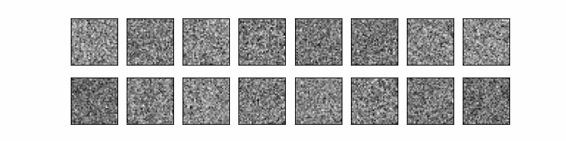

# Denoising Diffusion Probabilistic Models

### Introduction

Implementation for DDPM(Denoising Diffusion Probabilistic Models), trained on MNIST, CIFA10 and sprites_v1 datasets. You can download sprites_v1 dataset from [here](https://storage-dataset.oss-cn-zhangjiakou.aliyuncs.com/lbg/dataset/zip/dataset_tiefblue_bohr_27689_sprites-fbeg_v105761.zip). Download MNIST and CIFA10 datasets by running torchvision.datasets.

The process of generating samples is shown below (gif):





### Usage

If you want to use the sprites_v1 dataset, you need to download it from the link above. Then you should modify the path in the `train.py`, replace the `feature_file` and `label_file` with the path to the sprites_v1 dataset that you have downloaded.

To train the model, you can run the following command:
```shell
python train.py --dataset MNIST --path ./data
```

To generate samples, you should first run the following:
```shell
python test.py --dataset MNIST
```

You can run `visulization.ipynb` to see the process of training and generating samples.

```python
parser = argparse.ArgumentParser()
parser.add_argument("--timesteps", type=int, default=500)
parser.add_argument("--beta", type=float, nargs=2, default=[1e-4, 0.02])
parser.add_argument("--hidden_dim", type=int, default=128)
parser.add_argument("--context_dim", type=int, default=10)
parser.add_argument("--picture_shape", type=int, default=32)
parser.add_argument("--batch_size", type=int, default=128)
parser.add_argument("--epochs", type=int, default=64)
parser.add_argument("--lr", type=float, default=1e-3)
parser.add_argument("--device", type=str, default="cuda:0")
parser.add_argument("--dataset", type=str, default="sprites_v1", choices=["CIFA10", "CIFA10", "MNIST"])
parser.add_argument("--path", type=str, default="/home/d3ac/Desktop/dataset")
parser.add_argument("--save_rate", type=int, default=5)
parser.add_argument("--n_sample", type=int, default=16)
parser.add_argument("--row", type=int, default=2)
parser.add_argument("--save_path", type=str, default="results")
```